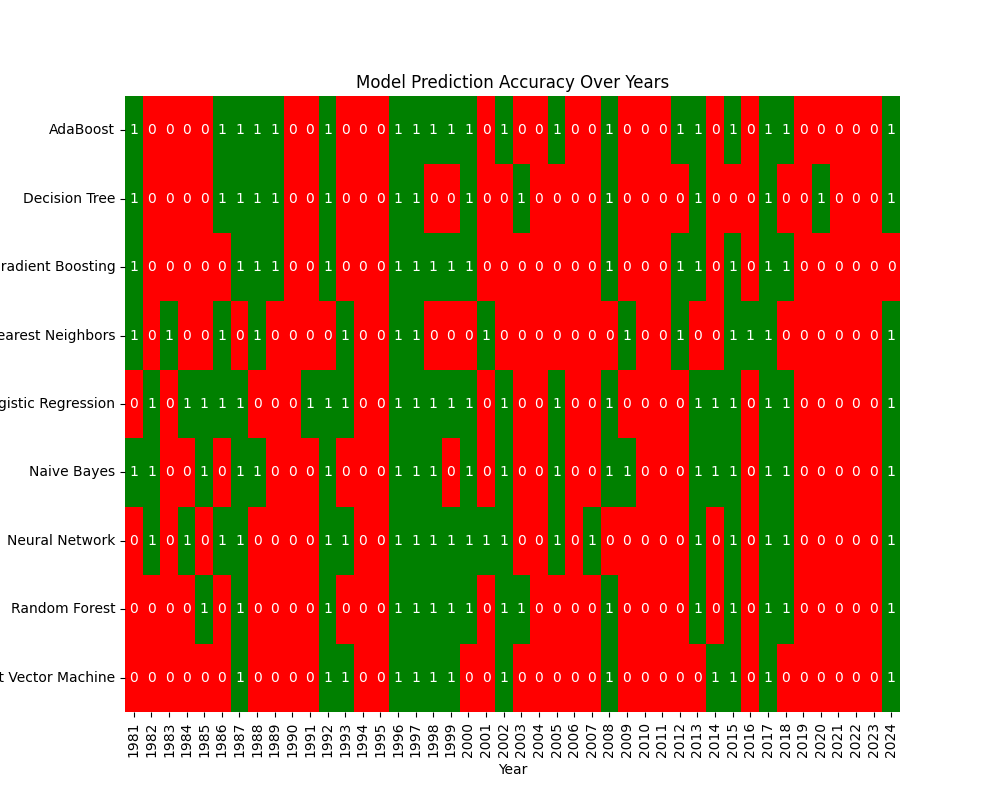
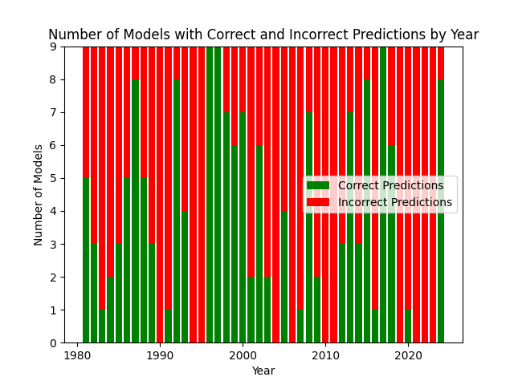
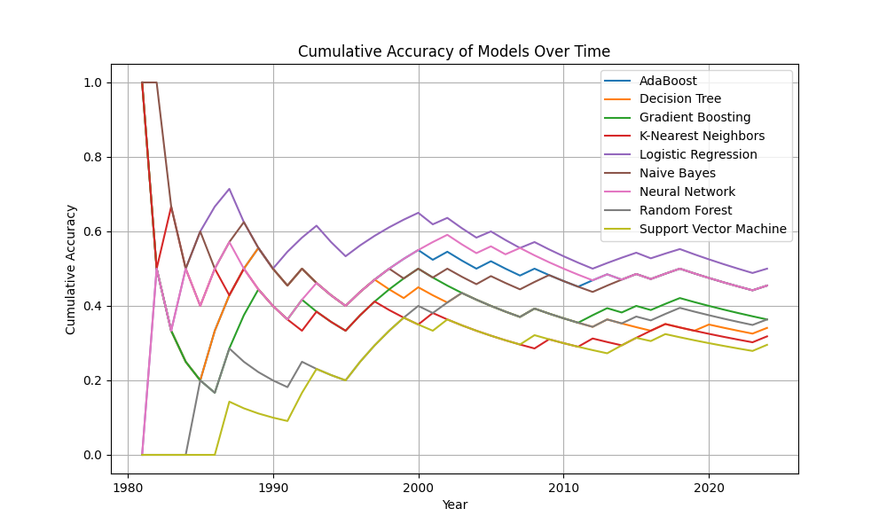
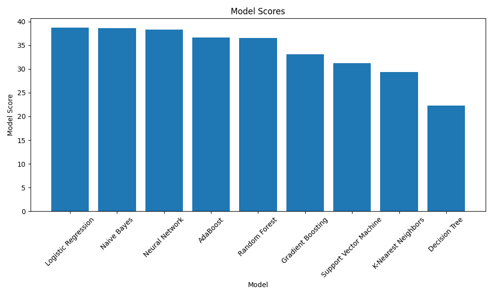

# Predicting NBA Champions Using Machine Learning
[](https://github.com/dapapp3/simple_pokedex/issues)
[](https://github.com/dapapp3/simple_pokedex/network)
[](https://github.com/dapapp3/simple_pokedex/stargazers)
[](https://www.youtube.com/channel/UCbsDR27rGCFdDKQVRl_tgEQ)

 

This project is a comprehensive exploration into predicting NBA championship winners using a blend of team statistics and betting data. Drawing on data meticulously gathered from basketball-reference.com, this analysis incorporates a wide array of statistics, from offensive and defensive ratings to performance in clutch games and against top contenders. The dataset spans every season from 1979-1980, offering a rich historical perspective. Additionally, pre-playoff betting odds, sourced from sportsoddshistory.com, add a unique dimension to the predictive models. Whether you're a basketball aficionado seeking insights into the factors that drive championship success or a data enthusiast curious about sports analytics, this project offers a detailed and engaging examination of what it takes to win the NBA championship. 

**Key Features:**  

- **Comprehensive Data Analysis**: Leverage extensive datasets from basketball-reference.com and sportsoddshistory.com, covering detailed team statistics and betting odds to provide a deep dive into the NBA's historical and current landscape.
- **Predictive Modeling**: Utilize a variety of machine learning models to forecast NBA championship outcomes, enhancing your understanding of what factors contribute most significantly to a team's success.

Constructed using the essential tools of a contemporary data analyst, this project is powered by Python for its core logic, with Pandas and Numpy facilitating data manipulation and analysis, and Scikit-learn enabling the application of machine learning models.

Designed for both basketball enthusiasts and data science aficionados, this project marries the thrill of sports analytics with the precision of machine learning, all within a user-friendly terminal interface. Whether you're predicting the next champion or exploring historical team performances, this tool offers a unique lens through which to view the NBA.

## Built With
- 
- 
- 
- 
- 

## Analysis
The heatmap of model prediction accuracy across different years, alongside the subsequent stacked bar chart, showcases distinct periods where forecasting the championship winner prior to the playoffs fluctuates in difficulty. This variation is notably influenced by the presence of dominant teams within the league, such as the Chicago Bulls in the late 1990s and the Los Angeles Lakers in the early 2000s, during which predictions tend to be more accurate across models. Conversely, periods characterized by a greater degree of parity among teams, particularly evident throughout most of the 2020s, present a more challenging environment for accurate championship predictions.

The predictive accuracy of the models may be improved by adding more sources of relevant data such as player statistical and award-related data and coaching data points.




The cumulative accuracy line chart underscores the challenges inherent in maintaining consistent predictive success for NBA championship outcomes prior to the start of the playoffs. Notably, among the various models evaluated, only the logistic regression model maintained an accuracy level of 50% by the end the observed period. This phenomenon may be attributed to several factors, including the exclusive reliance on team-level statistics for model training—thereby omitting potentially critical player-specific and coaching-related data. Additionally, unforeseen player injuries and the intrinsic unpredictability associated with certain basketball dynamics, such as shooting performance variability, further compound the difficulty of achieving high predictive accuracy.



The bar chart analysis of model scores reveals the logistic regression model's superior efficacy in champion prediction, accurately forecasting 22 out of 44 champions since 1981, which surpasses all other models by at least two correct predictions. However, models like Naive Bayes and Neural Networks demonstrated competitive performance. This was particularly evident when models were awarded partial points based on their ranking of the eventual champion's likelihood to win—full points for a correct prediction, diminishing fractionally [n-1/n, where n represents the total number of league teams in a given season] for lower-ranked predictions. This nuanced scoring approach underscores the close predictive capabilities among the various models, especially when considering the probabilistic nature of their predictions.



## Getting Started

This section provides a detailed guide on how to get the project up and running on your local machine.

### Prerequisites

- **Python**: The project requires Python 3.12. If you do not have Python installed, download and install it from [python.org](https://www.python.org/downloads/).

### Installation

Follow these steps to set up the project:

1. **Clone the Repository**

    First, you need to clone the project repository to your local machine. If you are unfamiliar with how to clone a repository, follow these steps:

    - Open your terminal (Command Prompt, PowerShell, or Terminal).
    - Navigate to the folder where you want to clone the project using the `cd` command. For example, to change to the Documents directory, you would type `cd Documents`.
    - Type the following command and press Enter:

      ```
      git clone https://github.com/dapapp3/ml_nba_champion_predictor.git
      ```

2. **Install Python (if necessary)**

    If you haven't installed Python yet, download it from [python.org](https://www.python.org/downloads/) and follow the installation instructions for your operating system.

3. **Install Required Dependencies**

    After cloning the repository and ensuring Python is installed, you need to install the project's dependencies. To do this:

    - Open your terminal and navigate to the project's root directory (where you cloned the repository).
    - Run the following commands to install the necessary Python packages:

      ```
      pip install pandas
      pip install numpy
      pip install requests
      pip install beautifulsoup4
      pip install scikit-learn
      pip install jupyterlab
      ```

### Running the Project

Once you have installed all the required dependencies, you can run the project by following these steps:

1. Open your terminal and navigate to the project's root directory.
2. Run the project by typing the following command and pressing Enter:
      ```
      python app.py
      ```

Congratulations! You should now have the project running on your local machine.

## Optimizations

The primary challenge encountered in this project was managing the time-intensive process of web scraping, particularly due to basketball-reference.com's rate limit of 20 requests per minute. To enhance efficiency, two key optimization strategies were implemented:

- **Selective Scraping** A dictionary mapping teams to years with available statistics pages was created. This allowed the program to intelligently bypass scraping attempts for teams without relevant data for a given year, thereby reducing unnecessary web requests.

- **Data Persistence** To eliminate the need for repeated scraping, the scraped data was saved to an Excel file which could be read into a pandas DataFrame on subsequent runs, streamlining the model training process.

These optimizations, while subtle, significantly improved the project's performance. For example, in 1980, the NBA comprised 22 teams, but the league has since expanded and some teams have moved or changed names. Given the rate limit, scraping data for each team took approximately 3 seconds per team, per season. By only scraping data for teams with relevant statistics, the optimizations saved substantial time, illustrating their effectiveness even in the project's early stages.

## Lessons Learned
While this was a very small and simple project, I did learn some valuable lessons. Including:

- How to scrape data from websites without getting blocked from rate limiting.
- How to clean data collected from websites and other external sources.
- More data does not always lead to better results.

One of the first lessons I learned while working on this project was how to efficiently scrape data from a website without triggering rate limits. For example, the first time I ran my code, I only scraped data for two teams over two seasons. This was to quickly ensure that the data was being extracted and saved as expected, without errors. Once I was confident in the data extraction process, I expanded the scope to include all the seasons in my sample.

Another critical lesson revolved around ensuring the data was clean and consistent. In some cases, the team name values didn't match across different pages. Some had trailing whitespace, others had numerical values, and some had asterisks to indicate a playoff berth. Had I not taken the time to inspect the data thoroughly, it would have led to unexpected results when trying to filter and calculate values.

Perhaps most surprisingly, in the world of big data that we live in, I discovered that an abundance of data does not inherently guarantee superior model performance. This discovery really opened my eyes to the importance of careful feature selection and the value of quality over quantity. As a result, the vast majority of the data scraped for this project, from per-game values to shooting statistics, were unused in the final dataset used to train the models.

## Roadmap
- ☐ Add Prior Award Data
  - ☐ Player Award Shares (MVP, FMVP, DPOY, 6MOY, All-NBA, All-Star)
  - ☐ Coaching Award Shares (Coach of Year)
- ☐ Add More Odds Data (Pre-season)
- ☐ Add Player Stats
  - ☐ Basic Stats (Points, Rebounds, Assists, Steals, Blocks, Turnovers, Personal Fouls)
  - ☐ Advanced Stats (PER, WS)